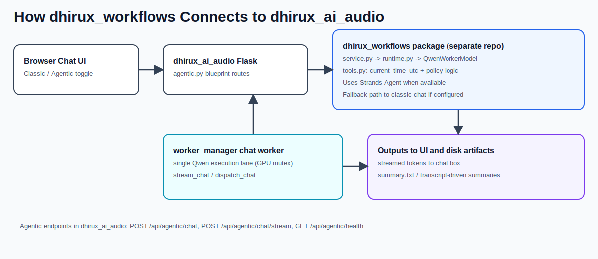

# dhirux_workflows

Strands-based orchestration package for Dhirux AI.

## Goal
- Keep agentic code isolated from Flask feature modules.
- Route text generation through the existing Qwen chat worker path so GPU mutex behavior is preserved.

## Entry points
- `runtime.py`: lazy Strands imports and agent construction.
- `qwen_worker_model.py`: custom model provider wrapper that uses `worker_manager.stream_chat`.
- `service.py`: service facade used by Flask routes.
- `tools.py`: workflow tools (includes `current_time_utc`).

## API route
- `POST /api/agentic/chat`
- `POST /api/agentic/chat/stream`
- `GET /api/agentic/health`

## How It Connects To `dhirux_ai_audio`
`dhirux_workflows` is a separate package/repo, but it is imported by `dhirux_ai_audio/agentic.py`.

Connection flow:
- Chat UI (Agentic mode) sends requests to Flask agentic endpoints.
- `agentic.py` calls `AgenticService` from `dhirux_workflows`.
- `AgenticService` runs Strands orchestration via `runtime.py`.
- Custom model provider `QwenWorkerModel` routes generation to `worker_manager.stream_chat`.
- This preserves the existing single Qwen worker / GPU mutex behavior in `dhirux_ai_audio`.

## Time Support (UTC + requested timezone)
Time support is implemented in `dhirux_workflows` with both a tool and a runtime guardrail:

- Tool: `tools.py` defines `current_time_utc()`
  - Returns current UTC time (`utc`)
- Agent registration: `runtime.py` passes `tools=[current_time_utc]` into the Strands `Agent`.
- Fast path for time questions: `runtime.py` detects time-intent queries (`_is_time_query`) and returns a deterministic answer format using `_format_time_response()`.
- Timezone parsing:
  - Supports direct IANA names like `America/Denver`, `Asia/Tokyo`
  - Supports common aliases like `denver`, `pst`, `est`, `london`, `tokyo`
  - Defaults to UTC when no timezone is requested
- Streaming + non-streaming paths both use this time-intent logic, so behavior is consistent in `/api/agentic/chat` and `/api/agentic/chat/stream`.
- English-only boundary:
  - System prompt in `config.py` requires English-only responses.
  - Runtime/service appends a policy reminder to enforce English in fallback and normal agent paths.
